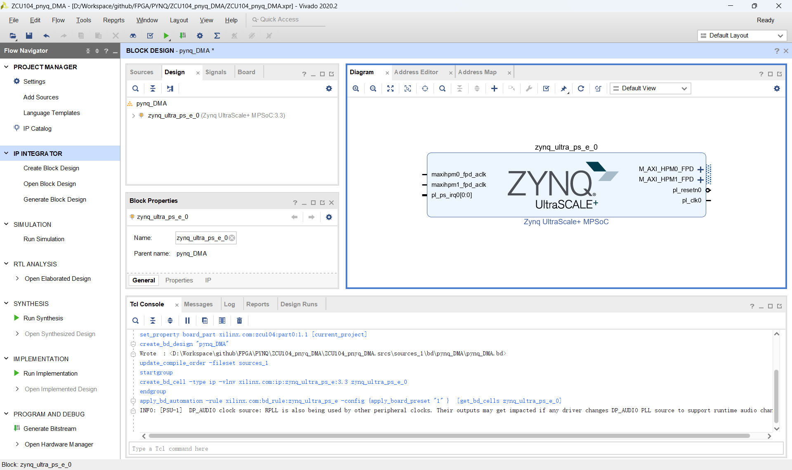
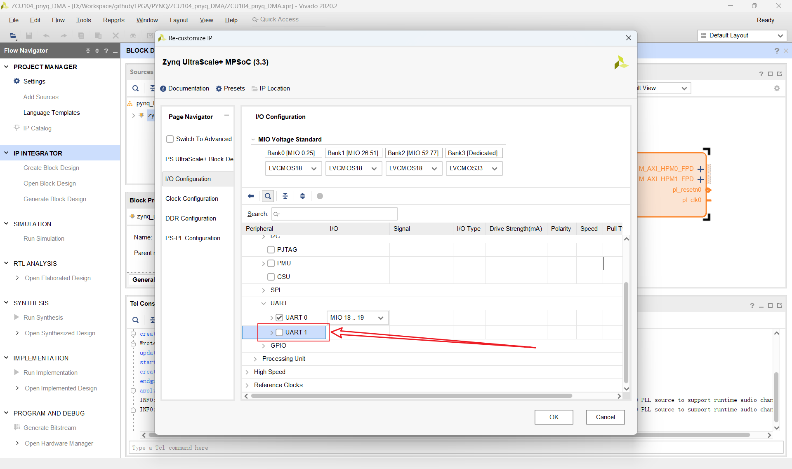
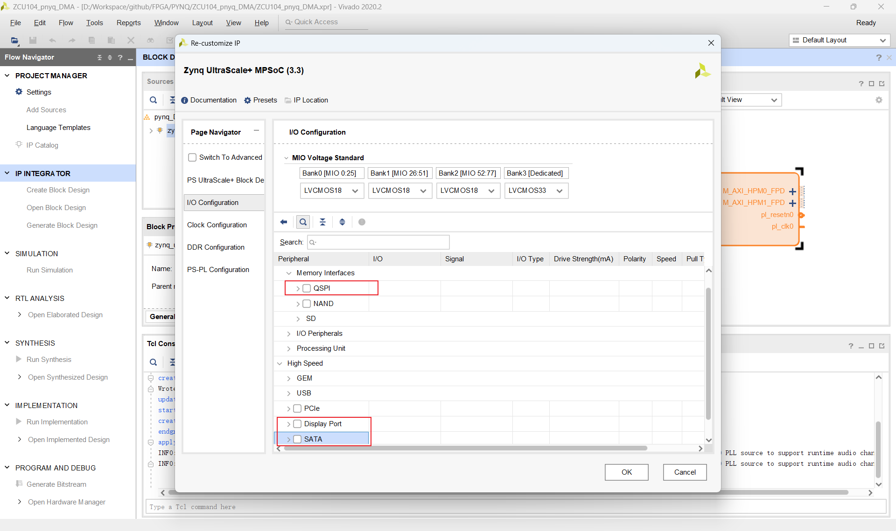
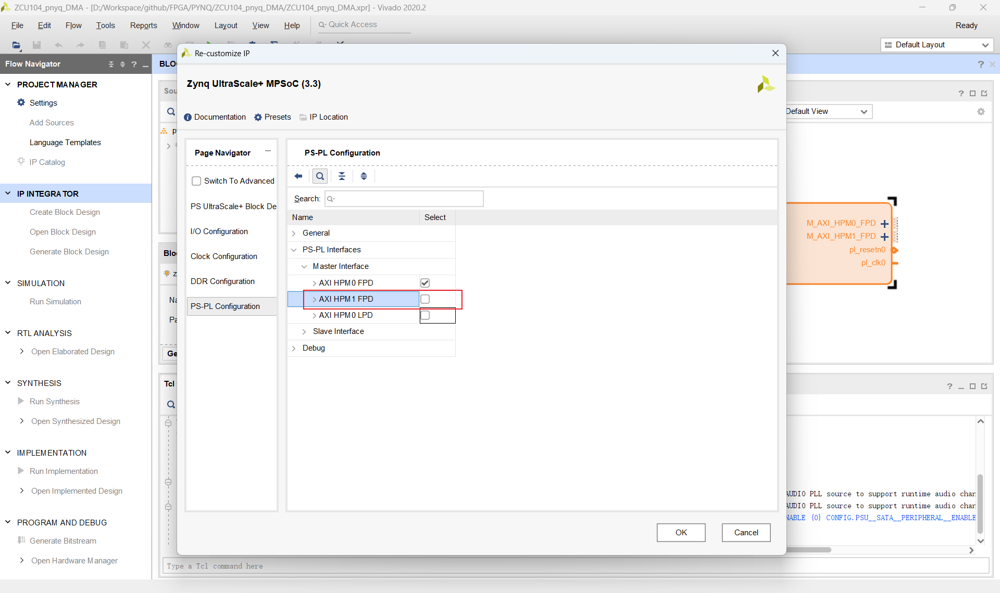
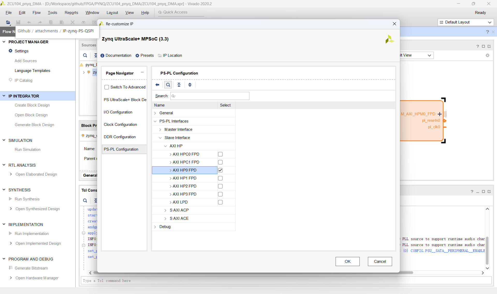
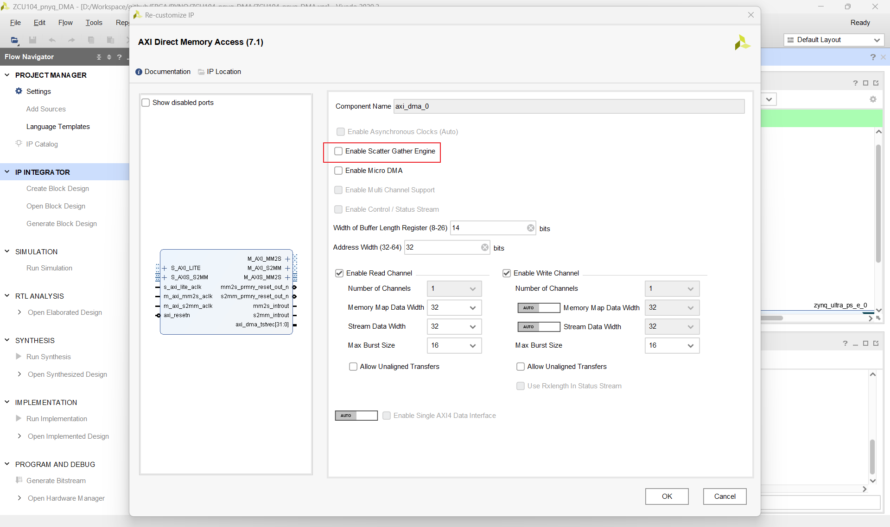
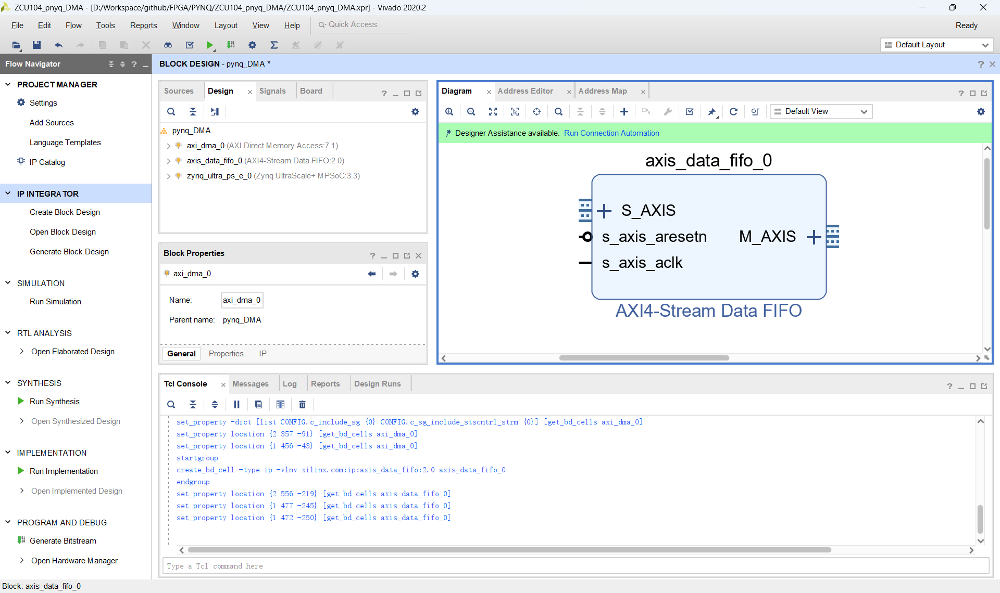
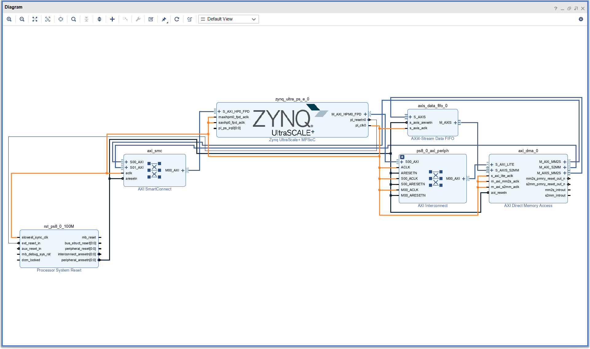
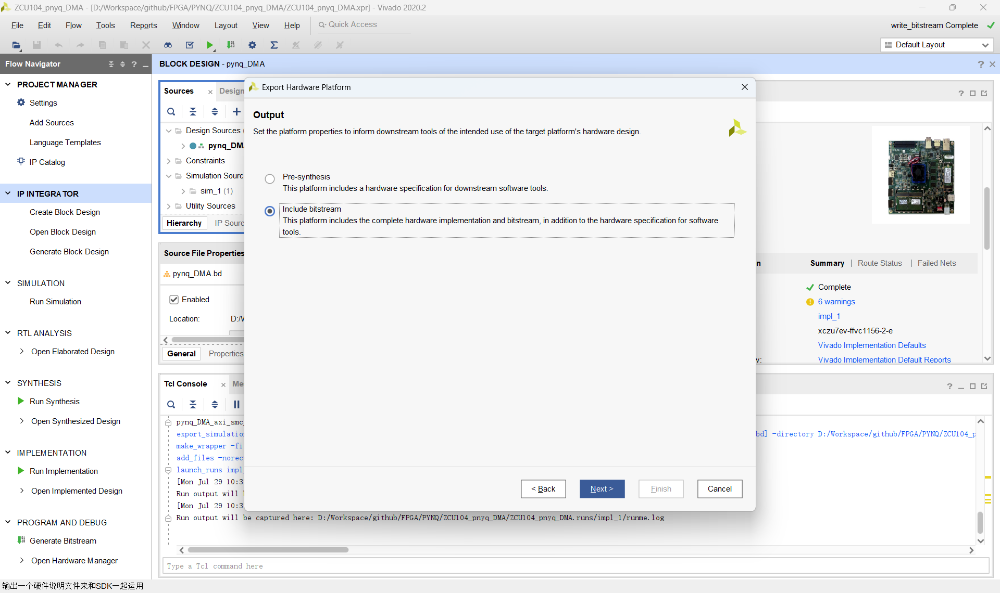
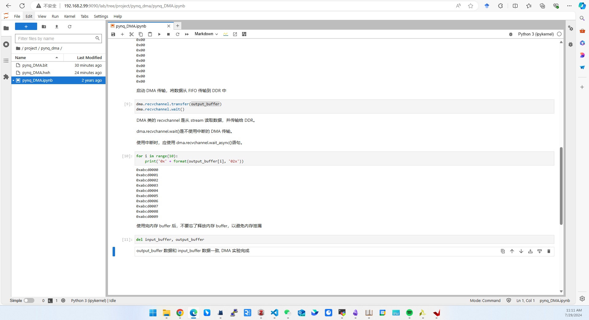

参考《5_领航者ZYNQ之PYNQ开发指南_V3.0 .pdf》第八章 Overlay 之 DMA 实验
以及《2_领航者ZYNQ之嵌入式Vitis开发指南v1_2.pdf》第二十章 AXI DMA 环路测试

## PYNQ DMA

### 硬件设计 Vivado

#### IP-ZYNQ

吸取教训，先创建 ZYNQ IP，然后 run block automation 之后再修改

取消勾选 UART1 的勾选，保持 UART0 的勾选

取消 QSPI、Display Port 以及 SATA 接口的勾选

有两个 AXI HP Master 端口，取消勾选 HPM1

没有 AXI HP Slave 端口，勾选上 AXI HP0 FPD，上面两个可能和 FMC 插座有关系

#### IP-DMA

取消勾选 Enable Scatter Gather Engine

#### IP-FIFO

fifo 保持默认即可

#### Connection

这一步还有点不确定，先试试可不可以
结合了教程
[Using AXI DMA on ZCU104 - Support - PYNQ](https://discuss.pynq.io/t/using-axi-dma-on-zcu104/779)
[DMA on the ZCU104 & PYNQ (youtube.com)](https://www.youtube.com/watch?v=6wnvDvvyDeQ)

这个教程蛮不错的，不过是以 PYNQ 官方的 FPGA 板为例
[FPGA 30 - Zynq SoC FPGA Direct Memory Access (DMA) between PS DDR memory and PL AXI4-Stream FIFO (youtube.com)](https://www.youtube.com/watch?v=tQpt2N7__NQ)

#### export hardware

导出 hwh 和 bit 文件至 pynq 文件夹（bit 由Vivado -Export - bitstream 得到）
### 软件设计 Vitis

### PYNQ 部分
参考 《5_领航者ZYNQ之PYNQ开发指南_V3.0 .pdf》

可以看到完成了 DMA 的 pynq demo，当然目前还只是似懂非懂，还需要深入研究一下
